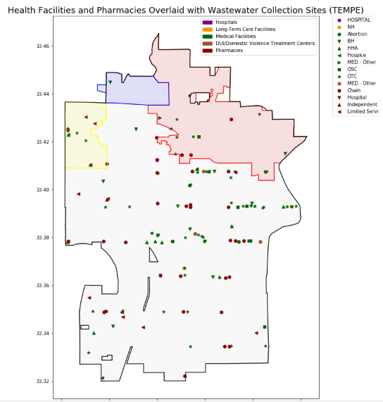
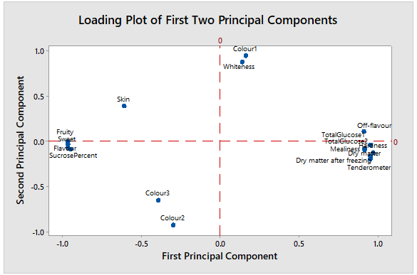
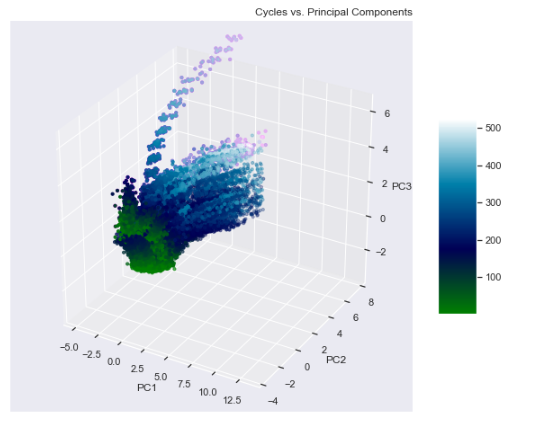

### Greetings (Portfolio Content Population in Progress)

  

      <ul class="nav">
          <li><a href="{{ BASE_PATH }}/assets/ResumeDec2019.pdf" target="_blank">Resume (Updated Dec, 2019)</a></li>
          <!--<li><a href="https://mingyuhuiliu.github.io/">Github</a></li>-->
        <li><a href="https://www.linkedin.com/in/olatunji-akinbule/" target="_blank">LinkedIn</a></li>
      </ul>
  

 

Olatunji Akinbule (TJ) is a recent graduate in the Data Analytics program at The George Washington University. As a  proactive and retentive data analyst, I am actively seeking full-time employment where I can utilize my analytical and data processing skills to analyze, interpret, predict and obtain insights for driving optimal business decisions.

<!--

  

      <ul class="nav">
-->

<!--
  

-->
### Portfolio: Skills/Tools Examples

<table class="narrow">
<tr>
  <td class="left">
    
  </td>
  <td class="right">
    
  </td>
</tr>
  <tr>
  <td class="left">
    
  </td>
  <td class="right">
    
  </td>
</tr>

</table>

  

      <ul class="nav">
          <!--create more figures page-->
          <li><a href="#">see more figures</a></li>
      </ul>
  

### Contact Me
Email: akinbule_ola@gwu.edu